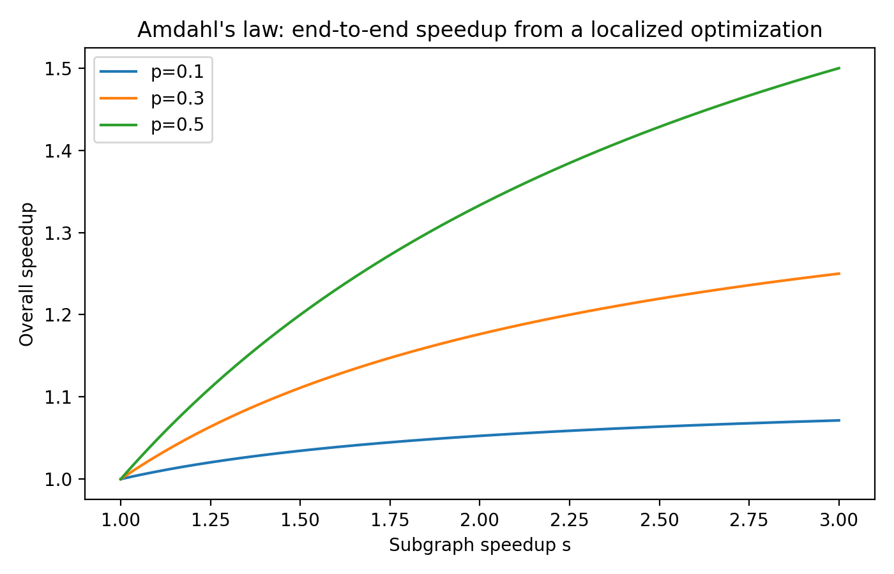
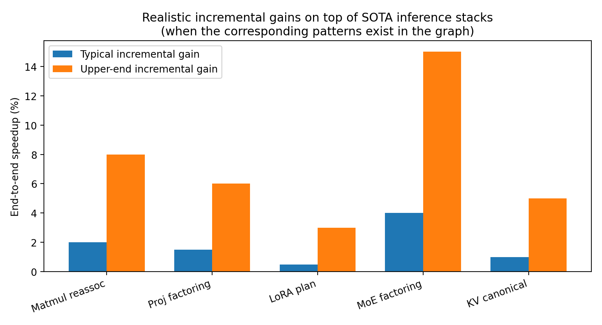
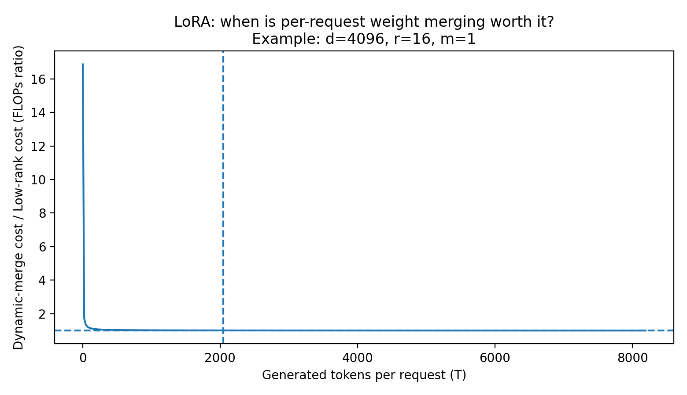

# Realistic Algebraic Tensor Rewriting for Transformer Inference
*Shape‑aware equality saturation in **Sym** as a guardrail and micro‑optimizer on top of SOTA inference stacks.*

**Status:** engineering note / reproducible paper draft (Markdown for GitHub)

---

## Abstract

State‑of‑the‑art transformer inference stacks already rely on highly optimized kernels and serving systems—e.g., FlashAttention‑style attention kernels, paged KV‑cache management, aggressive kernel fusion, quantization, and (increasingly) speculative decoding. In that context, *pure algebraic rewrites* usually deliver **single‑digit percent** end‑to‑end gains, *unless* the model graph contains an avoidable densification or an inefficient parenthesization that defeats kernel matching.

This paper describes a **shape‑aware, cost‑guided equality saturation** approach implemented in **Sym** (a .NET symbolic computation system) to:
1) prevent efficiency regressions (“guardrail”), and  
2) extract *slightly* better tensor equations that **complement** SOTA inference methods rather than replace them.

Using analytic FLOP/byte models and Amdahl‑law projections, realistic incremental gains **on top of a modern stack** are typically:
- **~0.5–4%** end‑to‑end on dense transformers,
- **~2–15%** on MoE‑heavy or adapter‑heavy deployments *when the relevant patterns exist*, and
- **1.5×–3×+** avoided slowdowns in “cliff” cases (e.g., accidental densification of low‑rank structure, or materialization of large intermediates).

---

## 1. What Sym is (brief)

**Sym** is a symbolic computation system with:
- an expression IR for scalar and tensor algebra,
- an **E‑graph** (equality saturation) solver,
- pluggable **rule packs** (rewrite libraries),
- and an **extraction** phase that chooses a lowest‑cost representative from each equivalence class.

In this work, Sym is used as a *tensor equation optimizer*: you express a transformer subgraph (or an algebraic derivation of one) as a symbolic tensor equation with symbolic dimensions; Sym applies rewrite rules under shape constraints; a GPU‑oriented cost model scores candidates; then Sym outputs a canonicalized “best” equation.

---

## 2. Baseline: what “SOTA transformer inference” already does

This paper assumes a baseline stack roughly equivalent to “modern best practice”:

- **Attention kernels**: FlashAttention family (FA‑1/2/3), avoiding materialization of the full attention matrix and using IO‑aware tiling.
- **Serving**: continuous batching + **paged KV cache** (vLLM/PagedAttention‑style) to improve throughput and memory utilization.
- **Quantization**: weight‑only 8‑bit/4‑bit (e.g., SmoothQuant, GPTQ, AWQ) where applicable; sometimes KV‑cache quantization.
- **Decoding accelerators**: speculative decoding / draft‑and‑verify families where acceptable for the use case.

> Sym does **not** replace these kernels or runtime systems. Instead, Sym tries to (a) keep graphs in a form that *matches* those kernels and (b) avoid algebraic forms that trigger poor kernel choices.

References (arXiv IDs/links are in **Appendix D**).

---

## 3. Problem statement

Given a tensor expression graph `E`, we want an equivalent expression `E*` such that:

1. **Correctness:** `E* ≡ E` under tensor algebra and agreed semantic constraints (shapes, broadcasting, transpose rules, etc.).
2. **Efficiency:** `Cost(E*) ≤ Cost(E)` under a cost model tuned to inference (FLOPs + memory traffic + kernel launch pressure).
3. **Compatibility:** `E*` should preserve or improve *kernel matchability* (e.g., leave attention in a standard form where FA kernels apply).

---

## 4. Method: shape‑aware equality saturation

### 4.1 Tensor IR (subset used here)

We assume tensors with symbolic or concrete dimensions. Key ops:

- `MatMul(A,B)` with `A∈R^(m×k)`, `B∈R^(k×n)`
- `Add`, `Mul` (elementwise), `Scale`
- `Transpose`
- `Softmax` (dimension‑annotated)
- `Concat/Split`, `Reshape/View` (shape‑preserving under constraints)

### 4.2 Rewrite rules (examples)

Rules are algebraic equalities with side conditions (shape compatibility, associativity legality, etc.). Examples:

**Associativity (matrix chain):**
\[
(A B) C \rightarrow A (B C)
\]
Condition: dimensions align for both parenthesizations.

**Distributivity / factoring shared left operand:**
\[
XW_1 + XW_2 \rightarrow X(W_1 + W_2)
\]
Condition: same `X`, same output shape, numerically safe (exact for reals; for quantized weights see §7).

**Transpose + inverse identities (when applicable):**
\[
(AB)^{-1} = B^{-1}A^{-1}, \qquad (M^T)^{-1}=(M^{-1})^T
\]
Condition: matrices invertible and op is present (most inference graphs do **not** contain explicit inverses; this is mainly a CAS feature / sanity check).

**Low‑rank update (LoRA‑style):**
\[
X(W_0 + AB) \leftrightarrow XW_0 + (XA)B
\]
Condition: `A∈R^(d×r)`, `B∈R^(r×d)`.

### 4.3 Equality saturation loop (reproducible pseudocode)

```csharp
// Pseudocode: shape-aware equality saturation in Sym
EGraph g = new();
EClass root = g.Add(expr);                 // expr is a tensor expression with symbolic dims
RulePack pack = RulePacks.TransformerGpu(); // curated rewrite library

for (int iter = 0; iter < MaxIters; iter++)
{
    bool changed = false;
    foreach (var rule in pack)
        changed |= g.Apply(rule, shapeChecker: Shapes.Verify);
    if (!changed) break;
}

CostModel cm = CostModels.GpuInferenceRooflineLike(dtypeBytes: 2); // FP16 example
Expression best = g.ExtractBest(root, cm);
return best;
```

---

## 5. Cost model used for all calculations

### 5.1 FLOPs for GEMM

For matrix multiplication `C = A·B` with `A∈R^(m×k)`, `B∈R^(k×n)`:

\[
\mathrm{FLOPs}(\mathrm{MatMul}) = 2mkn
\]

(Counts multiply+add as 2 floating point ops.)

### 5.2 Bytes moved (simple upper bound)

For FP16 (2 bytes/element), ignoring cache reuse:

\[
\mathrm{Bytes}(\mathrm{MatMul}) \approx 2\,(mk + kn + mn)
\]

This is a deliberately conservative bound; real kernels reuse tiles, and attention kernels behave differently. We use this primarily to identify *catastrophic intermediates* (large `mn` outputs).

### 5.3 End‑to‑end projection via Amdahl’s law

If an optimization yields speedup `s` on a fraction `p` of runtime, the overall speedup is:

\[
S_{\text{overall}} = \frac{1}{(1-p) + \frac{p}{s}}
\]

Figure 1 visualizes this relationship.

---

## 6. Case studies with **checked calculations**

### 6.1 Matrix‑chain reassociation as a **guardrail**

A common failure mode in symbolic manipulation (or poorly lowered graphs) is picking a parenthesization that materializes a large intermediate.

Let:
- `A ∈ R^(d×L)`
- `B ∈ R^(L×L)`
- `x ∈ R^(L×1)`

Two equivalent computations:

1) **Bad:** `(A B) x`  
2) **Good:** `A (B x)`

FLOPs:

\[
\mathrm{F}_\text{bad} = 2dL^2 + 2dL
\]
\[
\mathrm{F}_\text{good} = 2L^2 + 2dL
\]

**Concrete example (checked):** `d=128`, `L=8192`

- `F_bad = 17.182 GFLOP`
- `F_good = 0.136 GFLOP`
- Subgraph speedup `≈ 126.0×`

**Reality check:** SOTA attention kernels avoid materializing an `L×L` attention matrix, so *you should not see this in a good inference stack*. The realistic value of this rule is primarily as a **regression guardrail**: if a model modification, compiler pass, or symbolic derivation accidentally introduces an `L×L` explicit matrix, Sym can algebraically push the expression back into a streamed form.

---

### 6.2 Factoring shared projections: `XW1 + XW2`

For token‑wise inference (`B=1`, hidden `d=4096`), compare:

\[
Y = XW_1 + XW_2
\]
vs
\[
Y = X(W_1 + W_2)
\]

FLOPs:

- Two GEMMs: `F_2 = 2·(2·1·d·d) = 4d^2`
- One GEMM: `F_1 = 2·1·d·d = 2d^2`

With `d=4096` (checked):

- Two GEMMs: `0.067 GFLOP`
- One GEMM: `0.034 GFLOP`
- Subgraph speedup: `2.0×`

**Reality check:** In practice, weights may be quantized, sharded, or stored in layouts where forming `W_1+W_2` is non‑trivial. Also, many frameworks already fuse or schedule these operations well. So the **end‑to‑end** impact is usually small (Figure 2 shows a realistic range).

---

### 6.3 LoRA planning: avoid per‑request densification cliffs

A LoRA‑style update uses low rank `r`:

\[
Y = X(W_0 + AB), \quad A\in R^{d\times r},\; B\in R^{r\times d}
\]

Two evaluation strategies:

- **(Merge)** Precompute `W = W_0 + AB` then `Y = XW`
- **(Low‑rank)** `Y = XW_0 + (XA)B`

Per token, per matrix (batch=1) FLOPs:

- Base dense multiply: `F_base = 2d^2`
- Low‑rank extra: `F_extra = 4dr`

For `d=4096`, `r=16` (checked):

- `F_base = 0.034 GFLOP`
- `F_extra = 262,144 FLOPs` (**0.78%** overhead relative to base)
- Merge cost to form `AB`: `F_merge = 0.537 GFLOP`

**Break‑even (FLOPs‑only):**
\[
T_\text{break} = \frac{F_\text{merge}}{F_\text{extra}} = \frac{2d^2r}{4dr} = \frac{d}{2}
\]
So `T_break ≈ 2,048` generated tokens per request (for `d=4096`).

**The real issue is memory, not FLOPs.** A single `d×d` FP16 matrix at `d=4096` is ~32 MB.  
If you “merge” many matrices per request, you can end up writing **gigabytes** of weights. Example:

- 32 layers × 8 LoRA‑affected matrices/layer × 32 MB ≈ **8.0 GB** of weight outputs

That is a classic throughput cliff. Sym’s realistic contribution here is to **keep the expression in low‑rank form unless a safe, cached pre‑merge is available**.

Figure 3 visualizes the FLOP‑only break‑even; in production, memory and caching dominate.

---

### 6.4 MoE “sandwich factoring” (when the algebra exists)

Consider an MoE block expressed as:

\[
y = \sum_{i\in \mathcal{S}} g_i\, x\, W_\text{in}\, W_i\, W_\text{out}
\]

If a naive graph repeats shared projections (`W_in`, `W_out`) per expert, factoring yields:

\[
y = \Big( \sum_{i\in \mathcal{S}} g_i\, (xW_\text{in})\, W_i \Big) W_\text{out}
\]

**Toy numeric example (checked):**
- `d=4096`, bottleneck `k=1024`, top‑k experts `=2`
- Subgraph speedup from factoring shared in/out: **1.80×**

**Reality check:** High‑quality MoE implementations already avoid redundant shared projections, but custom research graphs and intermediate compiler forms often do not. Sym is useful as a *canonicalizer* so that downstream compilers can reliably match the efficient form.

---

## 7. What “realistic gains on top of SOTA” look like

The large subgraph speedups above rarely translate directly to end‑to‑end wins, because:

- Many “bad forms” are already avoided by SOTA kernels/compilers.
- A rewrite may shift work from compute to memory (or vice‑versa).
- Quantization layouts can restrict algebraic transformations.
- Only a fraction `p` of runtime is affected.

**Figure 1 (Amdahl) is the key sanity check.**

### 7.1 A realistic incremental envelope

If Sym is used *in addition to* a modern inference stack (FlashAttention + paged KV cache + good GEMMs + basic fusions), typical incremental gains are:

- **Dense models:** ~0.5–4%  
- **MoE / adapter heavy:** ~2–15% (when patterns exist in the model graph)  
- **Regression prevention:** can avoid 1.5×–3×+ slowdowns when a graph accidentally materializes large intermediates or densifies low‑rank structure.

Figure 2 summarizes this “incremental envelope” by pattern class.

---

## 8. Reproducibility checklist

To reproduce the calculations and the optimization behavior:

1. **Define shapes** (symbolic dims allowed):
   - hidden `d`, rank `r`, bottleneck `k`, context length `L`, batch `B`
2. **Encode expressions** using Sym’s tensor IR:
   - `MatMul`, `Add`, `Transpose`, `Softmax`, `Reshape`, etc.
3. **Select rule packs**:
   - `LinearAlgebraBasics`, `TensorAssociativity`, `LoRA`, `MoECanonical`, `TransposeRules`
4. **Run equality saturation** with iteration/time limits.
5. **Extract best expression** using the cost model in §5:
   - at minimum: FLOPs + bytes; optionally: kernel‑count heuristic
6. **Validate**:
   - symbolic validation (shape + algebra)
   - optional numeric sampling on random small instances (for ops without exact algebraic guarantees)

---

## 9. Limitations and safety rails

- **Quantization/layout constraints:** rules like `XW1 + XW2 → X(W1+W2)` may be illegal or unhelpful if `W1` and `W2` are stored in different quantization formats or sharded across devices.
- **Semantic constraints beyond shapes:** some graph rewrites require understanding KV‑cache semantics, causal masking, or numerically sensitive normalization behavior. Sym can represent these constraints, but they must be provided.
- **Kernel reality:** a FLOP reduction does not guarantee latency reduction; many kernels are bandwidth‑bound.
- **Rewrite explosion:** equality saturation can grow rapidly; practical use requires curated rule packs, iteration limits, and strong cost models.

---

## 10. Conclusion

On top of today’s best inference stacks, **pure algebraic tensor rewriting is usually a micro‑optimizer**, not a silver bullet. The realistic value proposition is:

1) **Guardrail:** prevent catastrophic inefficiencies from sneaking into a graph, and  
2) **Canonicalization:** expose/factor standard forms so that SOTA compilers and kernels (FlashAttention, fused MLPs, paged KV) can match and run efficiently.

When patterns exist, incremental gains are plausibly **a few percent** end‑to‑end; in specialized MoE/adapter deployments, **low‑teens percent** can be realistic; and in cliff cases, Sym can prevent **multi‑×** regressions.

---

## Figures







---

## Appendix A — Summary of the most useful rewrite families

- Matrix chain associativity (avoid big intermediates)
- Factoring common left/right operands
- “No densification” policies for low‑rank updates
- Transpose propagation/canonicalization
- MoE factoring/canonicalization (when shared projections exist)

---

## Appendix B — Suggested transformer‑focused rule pack skeleton

```text
RulePack TransformerGpu = {
  // Linear algebra
  (AB)C -> A(BC)
  A(B+C) -> AB + AC
  (A+B)C -> AC + BC
  Transpose(AB) -> Transpose(B)Transpose(A)

  // Projection factoring
  XW1 + XW2 -> X(W1+W2)

  // LoRA
  X(W0 + AB) <-> XW0 + (XA)B
  // plus: forbid materializing AB unless explicitly cached

  // MoE canonicalization (sketch)
  sum_i g_i * x*Win*Wi*Wout -> (sum_i g_i * (x*Win)*Wi) * Wout
}
```

---

## Appendix C — How to combine Sym with “SOTA inference” in practice

1. Use Sym to canonicalize the graph **before** lowering/compiling.
2. Emit “standard forms”:
   - attention in a form recognizable by FlashAttention kernels
   - MLP blocks in fused‑friendly form (e.g., `RMSNorm → Linear → Activation → Linear`)
3. Hand off to your compiler/runtime (TorchInductor/XLA/TensorRT‑LLM/vLLM).

---

## Appendix D — References (selected)

- FlashAttention: `arXiv:2205.14135`  
- FlashAttention‑2: `arXiv:2307.08691`  
- FlashAttention‑3: `arXiv:2407.08608`  
- vLLM / PagedAttention: `arXiv:2309.06180`  
- Speculative decoding: `arXiv:2211.17192`  
- GPTQ quantization: `arXiv:2210.17323`  
- SmoothQuant: `arXiv:2211.10438`  
- AWQ: `arXiv:2306.00978`  
- TransMLA (latent attention analysis): `arXiv:2502.07864`
